# Data Science Africa 2018 - Practical IoT

Welcome to the practical IoT session at DSA 2018. If you have any questions, please just give a shout. We are here to help.

In this session you'll build a greenhouse monitoring system; which we'll deploy into the field.

1. Simulating IoT devices with the Mbed simulator.
1. Building IoT devices with [Arm Mbed OS](https://os.mbed.com/).
1. Connecting your device to [The Things Network](https://www.thethingsnetwork.org/) using LoRaWAN.
1. Powering your device from a battery.

**Note: If the internet is too slow we can skip step 1 & 3! Please still follow step 2 in that case!**

## 1. Using the simulator

To help you build applications faster we have a device simulator. You can write your code and then see it run directly in your browser. Quite useful.

### Blinky

1. [Open the simulator](http://ec2-52-211-146-247.eu-west-1.compute.amazonaws.com:7829/).
1. Blinky runs, this is an application that just blinks the LED.
1. Currently `LED1` blinks. Try to change the code so that `LED2` will blink instead.
1. After making your change hit `Run` to run the application.

There are also components you can hook up.

1. Click *Add component*.
1. Select `Red LED`, and pin `p5`.
1. Click *Add*.
1. In your code change `LED2` (or `LED1`) into `p5` and click *Run*.
1. The red LED should blink.

### Reacting to an interrupt

You can also respond to human input through an 'interrupt'. This fires when a pin goes from high -> low, or low -> high.

1. In the editor paste:

    ```cpp
    #include "mbed.h"

    InterruptIn btn(BUTTON1);
    DigitalOut led(LED2);

    void toggle_led() {
        // switch the state of the LED
        led = !led;
    }

    int main() {
        // when the button goes from high->low, call the 'toggle_led' function
        btn.fall(&toggle_led);
    }
    ```

1. Hit `Run`.
1. Now if you press the button on the board the LED will toggle.
1. You can also respond to `rise`, this is when the button goes from low->high. Try to change the code so that the LED goes on when you press the button, and goes off when you release the button.

### Reading temperature and humidity data

Now to read some sensor data.

1. Click *Add component*.
1. Select `SHT31 temperature / humidity sensor` and click *Add component*.
1. Add the following code:

    ```cpp
    #include "mbed.h"
    #include "Sht31.h"

    Sht31 sht31(I2C_SDA, I2C_SCL);
    DigitalOut led(LED1);

    int main() {
        while (1) {
            float temp = sht31.readTemperature();
            float humidity = sht31.readHumidity();

            printf("Temperature: %.2f C, Humidity: %.2f %%\n", temp, humidity);

            wait(0.5f);
        }
    }
    ```

1. Click *Run*.

Now change the code so that the LED goes on if the temperature rises above 25 degrees.

## 2. Grabbing credentials from The Things Network

We have a LoRaWAN network set up here but you need some credentials to connect to it. Let's grab some credentials from The Things Network.

1. Log in to the [The Things Network console](http://console.thethingsnetwork.org).

    

1. Use the following credentials:
    * Username: `dsa2018`.
    * Password: `dsa2018`.
1. Click *Applications*.
1. Click on `dsa2018-workshop`.

    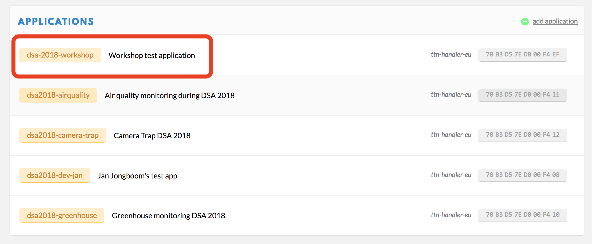

1. Click *Devices*.
1. Click *Register device*.

On the register device page:

1. First click the *generate* button below 'Device EUI'.

    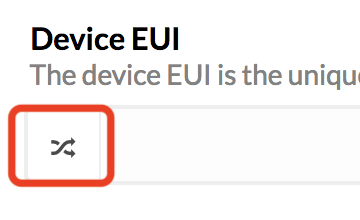

1. Enter a nice name for your device and click *Register*.

    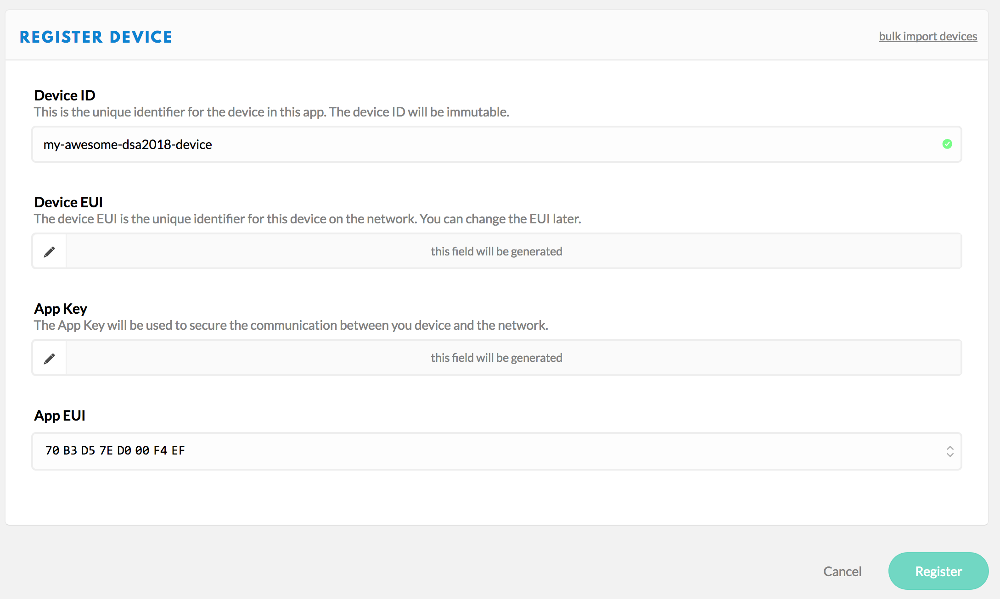

1. Click **Settings**.

    

1. Switch to **ABP**.

    

1. Disable (or uncheck) frame counter checks.

    

1. Click **Save**.

### 3. Connecting to TTN from the simulator

You can talk directly to The Things Network from the simulator.

1. In the simulator click the dropdown menu, and select `LoRaWAN (ABP)`.
1. Click *Load demo*.

    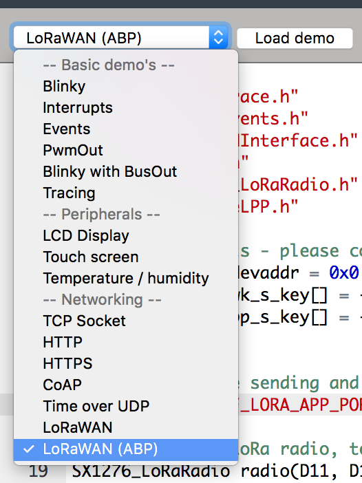

Now we need to put the credentials from TTN into the simulator.

In the TTN console:

Now we need to get the device address, network session key and application session key.

1. Click the **Copy** button next to 'Device Address' to copy to clipboard.

    

1. Click the `< >` button of the **Network session key** and **Application session key** values to show the value as C-style array.
1. Click the **Copy** button on the right of the value to copy to clipboard.

Paste these keys into the simulator:

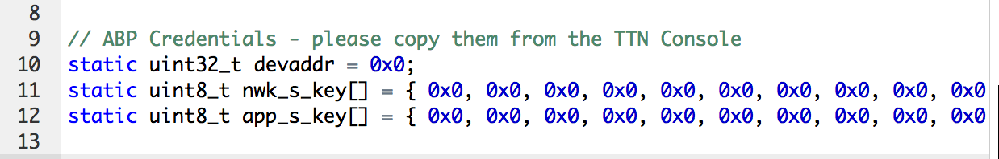

* Put Device Address on the first line, prefixed with `0x`!
* Put Network Session Key on the second line, don't forget to add `;` at the end.
* Put Application Session Key on the third line, don't forget to add `;` at the end.

Now click *Run*.

#### Sending data over

Now click the button on the simulated development board. After a second it should say `XX bytes scheduled for transmission`.

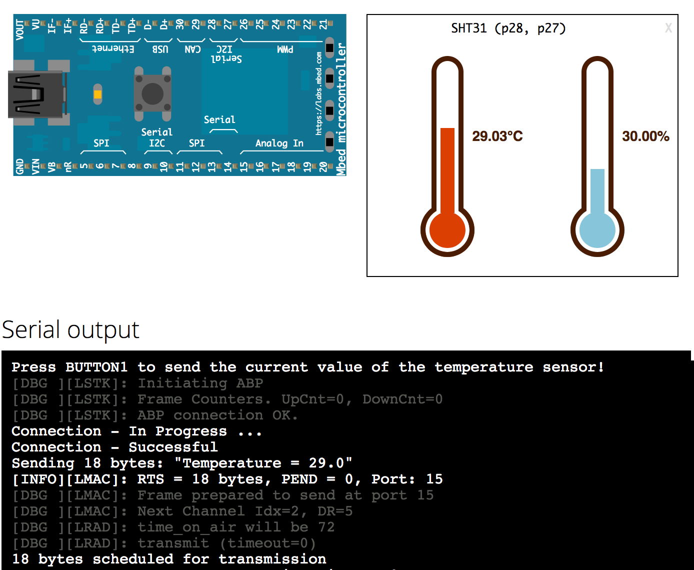

If you switch back to the TTN console, under the `Data` tab you should now see your message:

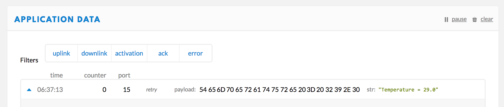

Success!

## 4. Switching to a physical board

Let's do something with the real board now.

### Prerequisites

1. Create an Arm Mbed online account [here](https://os.mbed.com/account/signup/).
1. Then install the following software for your operating system below:

**Windows**

If you are on Windows, install:

1. [ST Link](http://janjongboom.com/downloads/st-link.zip) - serial driver for the board.
    * Run `dpinst_amd64` on 64-bits Windows, `dpinst_x86` on 32-bits Windows.
    * Afterwards, unplug your board and plug it back in.
    * (Not sure if it configured correctly? Look in 'Device Manager > Ports (COM & LPT)', should list as STLink Virtual COM Port.
1. [Tera term](https://osdn.net/projects/ttssh2/downloads/66361/teraterm-4.92.exe/) - to see debug messages from the board.

**Linux**

If you're on Linux, install:

1. screen - e.g. via `sudo apt install screen`

**MacOS**

Nothing required.

### Building the circuit

Grab a:

* Nucleo-F446RE development board.
* Super-special limited edition DSA LoRaWAN shield.
* Antenna.
* Grove temperature / humidity sensor.
* Moisture sensor.
* Optionally: battery pack - not required here, but required for the fieldwork.

Now:

1. Click the shield on top of the development board.
1. Click the antenna on the 868/915 MHz uFl connector.

To connect the sensors we need to do a trick.

1. Click the connector cable onto the sensor.
1. On the other end there is four holes.
1. Take three jumper wires (male->female) and stick them into the *yellow*, *red* and *black* holes (we don't use white).

    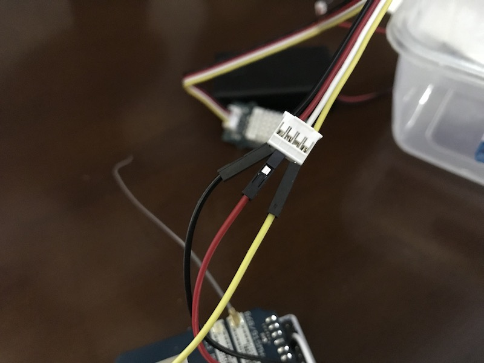

1. Now connect the other ends to the development board, to the following pins...

**Temperature / humidity sensor**

Some **important** notes:

1. This is the side of the board next to the *Arm Mbed* logo (on the shield)!!!
1. The correct orientation of the board is when all the logos are on the top.
1. We use only the **inner** lane of pins.

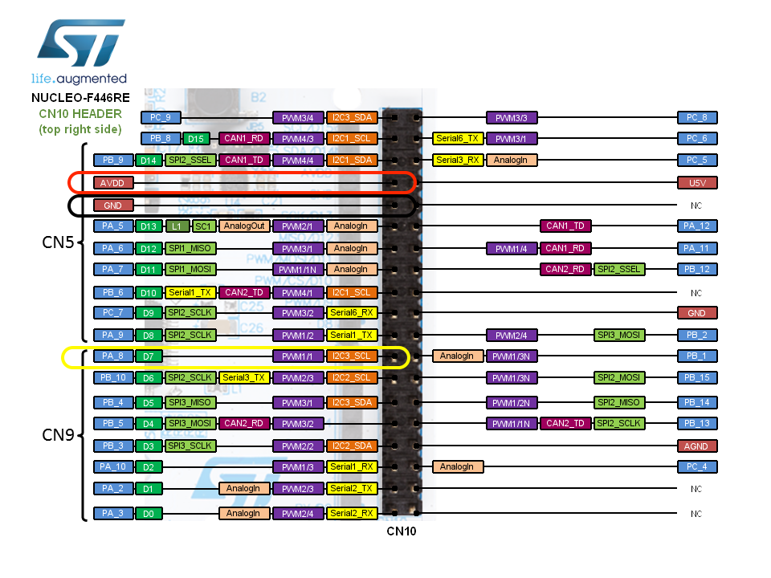

Connect red to AVDD, black to GND, yellow to D7.

**Humidity sensor**

Some **important** notes:

1. This is the side of the board next to the *DSA* logo (on the shield)!!!
1. The correct orientation of the board is when all the logos are on the top.

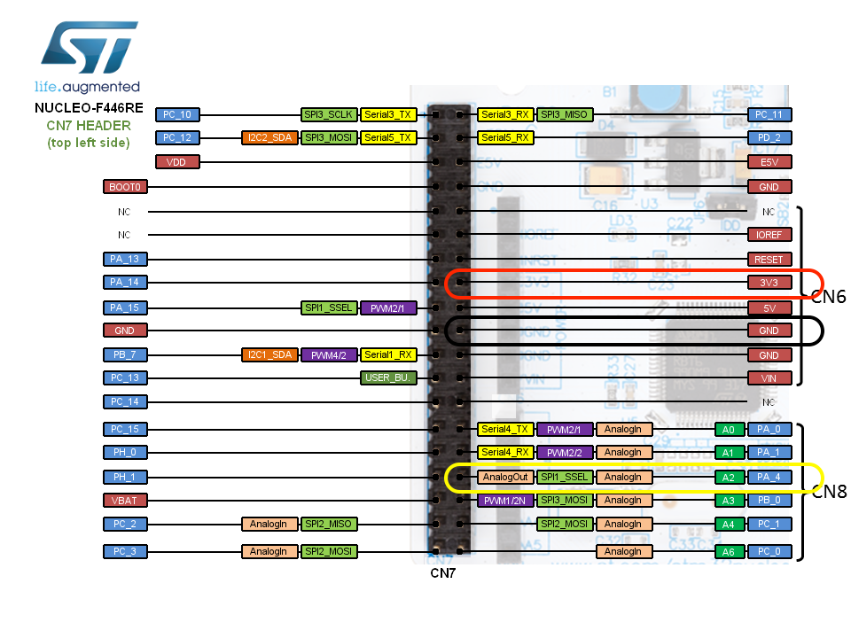

Connect red to 3.3V, black to GND, yellow to A2.

## 5. Verifying the circuit by building an application

Now let's build a simple application which reads the sensor data and prints it to the serial console.

1. Go to [https://os.mbed.com](https://os.mbed.com) and sign up (or sign in).
1. Go to the [NUCLEO-F446RE](https://os.mbed.com/platforms/ST-Nucleo-F446RE/) platform page and click *Add to your Mbed compiler*.
1. Import the example program into the Arm Mbed Compiler by clicking [this link](https://os.mbed.com/compiler/#import:https://github.com/janjongboom/dsa2018-greenhouse-monitor).
1. Click *Import*.
1. In the top right corner make sure you selected 'NUCLEO-F446RE'.

    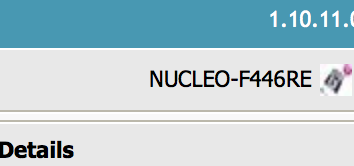

This has cloned the repository.

1. Click *Compile*.

    

1. A binary (.bin) file downloads, use drag-and-drop to copy the file to the NODE_F446RE device (like a USB mass storage device).

    **Note:** Here's a [video](https://youtu.be/L5TcmFFD0iw?t=1m25s).

1. When flashing is complete, hit the **RESET** button on the shield.

### Inspecting logs

Let's inspect the logs... If all is well, you should see something similar to:

```
Temperature is 23.00 C
Temperature is 73.40 F
Temperature is 296.15 K
Humidity is 56.00
Dew point is 13.77
Dew point (fast) is 13.74
Moisture is 0.000
```

#### Windows

To see debug messages, install:

1. [ST Link](http://janjongboom.com/downloads/st-link.zip) - serial driver for the board.
    * Run `dpinst_amd64` on 64-bits Windows, `dpinst_x86` on 32-bits Windows.
    * Afterwards, unplug your board and plug it back in.
    * (Not sure if it configured correctly? Look in 'Device Manager > Ports (COM & LPT)', should list as STLink Virtual COM Port.
1. [Tera term](https://osdn.net/projects/ttssh2/downloads/66361/teraterm-4.92.exe/) - to see debug messages from the board.

When you open Tera Term, select *Serial*, and then select the Mbed COM port.


#### MacOS

No need to install a driver. Open a terminal and run:

```
screen /dev/tty.usbm            # now press TAB to autocomplete and then ENTER
```

To exit, press: `CTRL+A` then `CTRL+\` then press `y`.

#### Linux

If it's not installed, install GNU screen (`sudo apt-get install screen`). Then open a terminal and find out the handler for your device:

```
$ ls /dev/ttyACM*
/dev/ttyACM0
```

Then connect to the board using screen:

```
sudo screen /dev/ttyACM0 9600                # might not need sudo if set up lsusb rules properly
```

To exit, press `CTRL+A` then type `:quit`.

## 6. Sending the data to The Things Network

In the Online Compiler:

1. Open `select_program.h`.
1. Change:

    ```
    #define         PROGRAM                     TEST_TEMP
    ```

    into:

    ```
    #define         PROGRAM                     GREENHOUSE_MONITOR
    ```

1. Then, open `1_greenhouse.cpp`.
1. On line 17-19, add the keys from The Things Network (see step 2 & 3).
1. Click *Compile*.

    

1. A binary (.bin) file downloads, use drag-and-drop to copy the file to the NODE_F446RE device (like a USB mass storage device).

    **Note:** Here's a [video](https://youtu.be/L5TcmFFD0iw?t=1m25s).

1. When flashing is complete, hit the **RESET** button on the shield.

Inspect the logs on the device... They should say something like:

```
=========================================
      DSA 2018 Green House Monitor
=========================================
Sending every 20 seconds
[DBG ][LSTK]: Initializing MAC layer
[DBG ][LSTK]: Initiating ABP
[DBG ][LSTK]: Frame Counters. UpCnt=0, DownCnt=0
[DBG ][LSTK]: ABP Connection OK!
Connection - In Progress ...
Connection - Successful
Temp=23.000000 Humi=55.000000
Moist=0.000000
Sending 11 bytes
[INFO][LSTK]: RTS = 11 bytes, PEND = 0
[DBG ][LMAC]: Next Channel Idx=0, DR=4
[DBG ][LSTK]: Frame scheduled to TX..
11 bytes scheduled for transmission
```

And you should now see data in The Things Network console for your device. Success!

## 7. Battery powered

Unfortunately a small mistake was made on the shield regarding polarity of the battery connector, so to connect a battery:

1. Take battery holder and place 3 AAA batteries in there.
1. Jam two wires into the connector.
1. Connect them to Vin (red) and GND (black), these are on the left side of the shield (side with the DSA logo).

    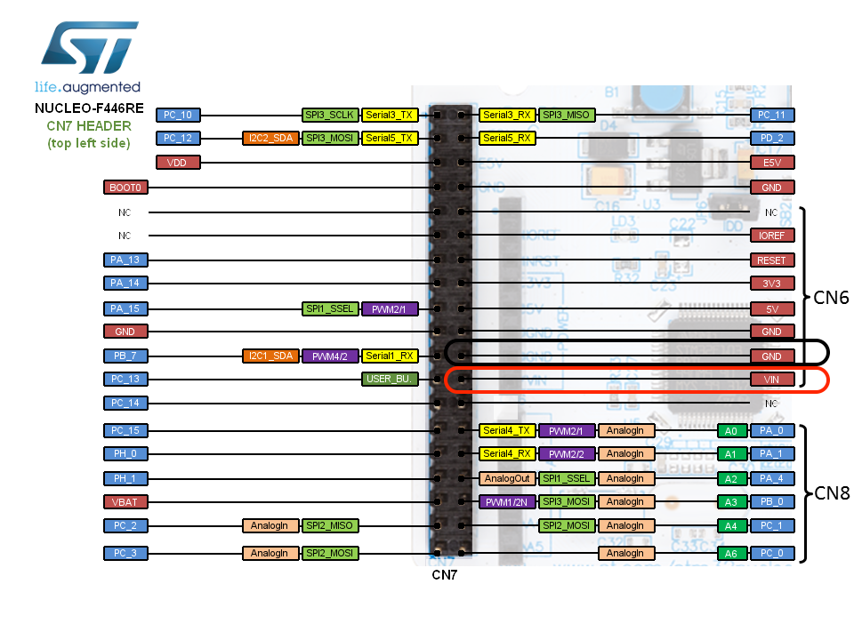

1. Then remove the USB cable, and remove the shield, and find jumper JP5.

    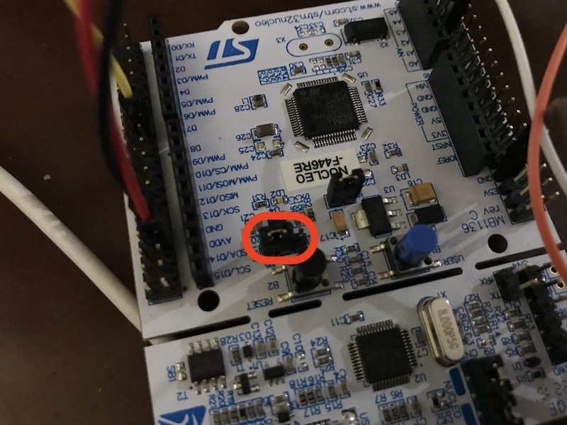

1. Move it from U5V to E5V.
1. Place the shield back.
1. Switch the battery holder on.
1. The device is back online.
